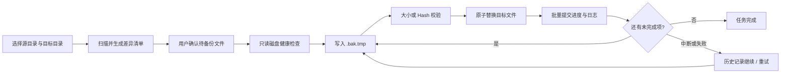

<div align="center">
  
  <h1>VaultGuard · 备份了嘛</h1>
  <p>面向 macOS 与 Windows 的本地硬盘增量备份工具，以文件安全、断点续传和故障隔离为核心。</p>

  [](https://github.com/FishXIN/VaultGuard/releases/latest)
  [](https://github.com/FishXIN/VaultGuard/actions/workflows/core-tests.yml)
  [](https://github.com/FishXIN/VaultGuard/actions/workflows/build-windows.yml)
  [](#平台支持)
  [](LICENSE)
</div>

---

VaultGuard 会扫描源目录与目标目录，只处理新增或更新的文件。每次备份都先生成清单供用户确认，再以临时文件写入、校验和原子替换完成复制。任务中断或个别文件失败后，可以从历史记录继续，仅重试尚未完成的文件。

## 下载

前往 [最新版本](https://github.com/FishXIN/VaultGuard/releases/latest) 下载对应平台安装包：

| 平台 | 架构 | 下载文件 | 状态 |
| --- | --- | --- | --- |
| macOS | Apple Silicon / arm64 | `VaultGuard-*-arm64.zip` | 支持 |
| Windows | x64 | `VaultGuard-*-windows-x64.zip` | 支持 |
| macOS Intel | x64 | 暂未提供 | 计划中 |
| Windows ARM | arm64 | 暂未提供 | 计划中 |

每个 Release 同时提供 `checksums.txt`，可使用 SHA-256 校验下载完整性。

## 为什么选择 VaultGuard

| 能力 | 说明 |
| --- | --- |
| 增量备份 | 只复制新增和更新文件，未变化文件自动跳过 |
| 文件安全 | `.bak.tmp` 临时写入、`fsync`、大小校验、原子替换 |
| 断点续传 | 暂停、取消、意外中断后只处理未完成文件 |
| 失败隔离 | 单个文件失败不阻塞后续文件，历史记录可直接重试 |
| 任务队列 | 多个备份任务按创建顺序持久化、串行执行 |
| 坏盘抢救 | 异常源盘优先小文件，单文件卡住后自动跳过 |
| 只读健康检查 | 仅读取磁盘状态，不运行自检、扇区扫描或写入测速 |
| 完整记录 | SQLite 保存任务和文件结果，同时输出可读文本日志 |

## 工作流程



## 安全设计

- **覆盖前不破坏旧文件**：新内容先写入同目录临时文件，校验完成后再原子替换。
- **断电可恢复**：数据库只把安全完成的文件标记为完成；未提交的小批次会在下次继续时重新复制。
- **失败项保留**：权限不足、文件占用或 I/O 错误不会被误标为成功。
- **删除默认关闭**：默认不删除目标端额外文件；坏盘抢救模式会强制禁用删除同步。
- **无破坏性磁盘检查**：不会执行 SMART 自检、修复、坏道扫描或写入测速。
- **单任务互斥**：同一任务禁止重复并发执行，避免重复复制与统计错乱。

更完整的漏洞报告方式见 [SECURITY.md](SECURITY.md)。

## 平台支持

| 能力 | macOS | Windows |
| --- | :---: | :---: |
| 图形界面 | ✅ | ✅ |
| 命令行 | ✅ | ✅ |
| 原生目录选择器 | ✅ | ✅ |
| 磁盘状态查询 | `diskutil info` | `Get-Disk` |
| 自动更新 | ✅ | ✅ |
| 代码签名 / 公证 | 暂无 | 暂无 |

> 当前安装包未购买 Apple Developer ID 或 Windows 代码签名证书，首次打开时可能出现系统安全提示。

### macOS 首次打开

1. 在“备份了嘛.app”上右键，选择“打开”。
2. 若仍被拦截，进入“系统设置 → 隐私与安全性”，点击“仍要打开”。
3. 若系统提示应用已损坏，可移除下载隔离标记：

```bash
xattr -dr com.apple.quarantine "/Applications/备份了嘛.app"
```

### Windows 首次打开

出现 SmartScreen 提示时，点击“更多信息 → 仍要运行”。

## 从源码运行

要求 Python 3.12。

```bash
git clone https://github.com/FishXIN/VaultGuard.git
cd VaultGuard

python3 -m venv .venv
.venv/bin/pip install -r requirements.txt
.venv/bin/pip install "flet==0.86.5"

# macOS / Linux
.venv/bin/python main.py

# Windows PowerShell
.\.venv\Scripts\python.exe main.py
```

### 命令行

```bash
python cli.py compare <源目录> <目标目录>
python cli.py backup <源目录> <目标目录>
python cli.py backup <源目录> <目标目录> -y
python cli.py backup <源目录> <目标目录> --resume
python cli.py history
```

## 数据位置

| 平台 | 默认数据目录 |
| --- | --- |
| macOS | `~/Library/Application Support/VaultGuard` |
| Windows | `%APPDATA%\VaultGuard` |

可使用环境变量 `VAULTGUARD_DATA_DIR` 覆盖。目录中包含配置、SQLite 数据库、任务日志和错误报告。

## 项目结构

```text
VaultGuard/
├── main.py                       # 桌面应用入口
├── cli.py                        # 命令行入口
├── build_app.sh                  # macOS 构建
├── build_windows.ps1             # Windows 构建
├── vaultguard/
│   ├── core/
│   │   ├── scanner.py            # 扫描与差异比较
│   │   ├── executor.py           # 任务执行、断点续传、失败隔离
│   │   ├── copy_worker.py        # 独立复制进程
│   │   ├── disk_health.py        # 只读磁盘健康检查
│   │   ├── database.py           # SQLite 持久化
│   │   └── service.py            # GUI / CLI 共用服务层
│   └── ui/
│       └── app.py                # Flet 桌面界面
└── tests/
    └── test_core.py              # 核心自动化测试
```

## 测试与构建

```bash
PYTHONPATH=. .venv/bin/python tests/test_core.py
git diff --check
```

当前核心测试覆盖原子复制、mtime 回写、增量跳过、失败隔离、断点续传、任务队列、坏盘超时、小文件批量落库及历史任务重试。

构建命令：

```bash
./build_app.sh
.\build_windows.ps1
```

## 参与贡献

- 提交问题前请先搜索 [Issues](https://github.com/FishXIN/VaultGuard/issues)。
- Bug 报告请附版本、平台、复现步骤和相关日志。
- 开发规范与提交要求见 [CONTRIBUTING.md](CONTRIBUTING.md)。
- 一般使用问题见 [SUPPORT.md](SUPPORT.md)。
- 版本变化见 [CHANGELOG.md](CHANGELOG.md)。

## 路线图

- macOS Intel 与 Windows ARM 构建
- 代码签名与 macOS 公证
- 定时备份与多配置管理
- 更细粒度的速度与故障统计
- NAS / 网络目标专项优化

## License

[MIT](LICENSE) © FishXIN
